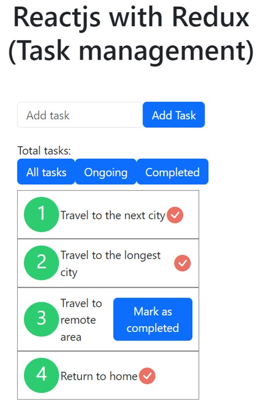

# reactjs_with_redux

This app aim to show how to use React with Redux. This is small Task Management app.
 

## Project Setup

```sh
npm install
```

### Run backend (Json Server will be served in port: 3000)

```sh
npm run start
```

### Compile and Hot-Reload for Development (App will be served in port: 3001)

```sh
npm run dev
```

### Compile and Minify for Production

```sh
npm run build
```